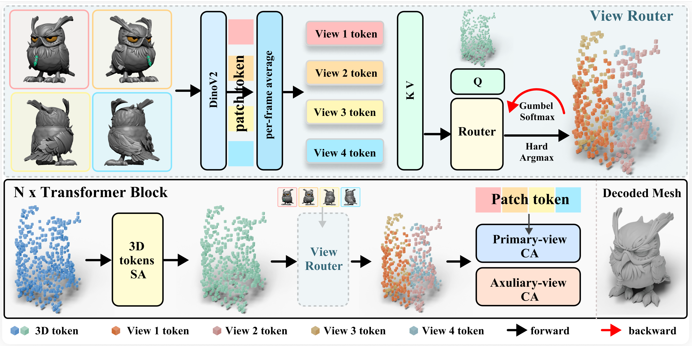

<div align="center">

# ROAR-3D: ROuting ARbitrary Views for High-Fidelity 3D Generation

**Anonymous Authors**

[](https://arxiv.org/)
[](https://roar-3d.github.io/)

</div>

## Teaser

<p align="center">
  
</p>

Single-image-to-3D generative models can now produce high-quality geometry, yet conditioning on a single view inevitably introduces ambiguity about unseen regions. We propose **ROAR-3D**, a lightweight method that upgrades a pretrained single-view model to accept an arbitrary number of unposed images. A *token-wise view router* assigns each 3D latent token to its most relevant view, implicitly establishing 2D-to-3D correspondences without explicit pose input. A *dual-stream attention* design preserves the pretrained primary-view behavior while routing auxiliary views through a separate path dedicated to geometric enrichment. ROAR-3D achieves state-of-the-art multi-view 3D generation quality and supports test-time view scaling from 1 to 12+ views with consistent improvements.

## Pipeline

<p align="center">
  
</p>

## TODO

- [ ] Upload paper to arXiv
- [ ] Release online demo
- [ ] Release inference code & pretrained weights
- [ ] Release training code

<!-- ## Citation

If you find this work useful, please consider citing:

```bibtex
@article{roar3d2025,
  title={ROAR-3D: ROuting ARbitrary Views for High-Fidelity 3D Generation},
  author={Anonymous},
  year={2025}
}
```

## Acknowledgements

Our project page is built upon [Nerfies](https://nerfies.github.io/) and [FlexiTex](https://github.com/PatrickDDj/FlexiTex). -->
